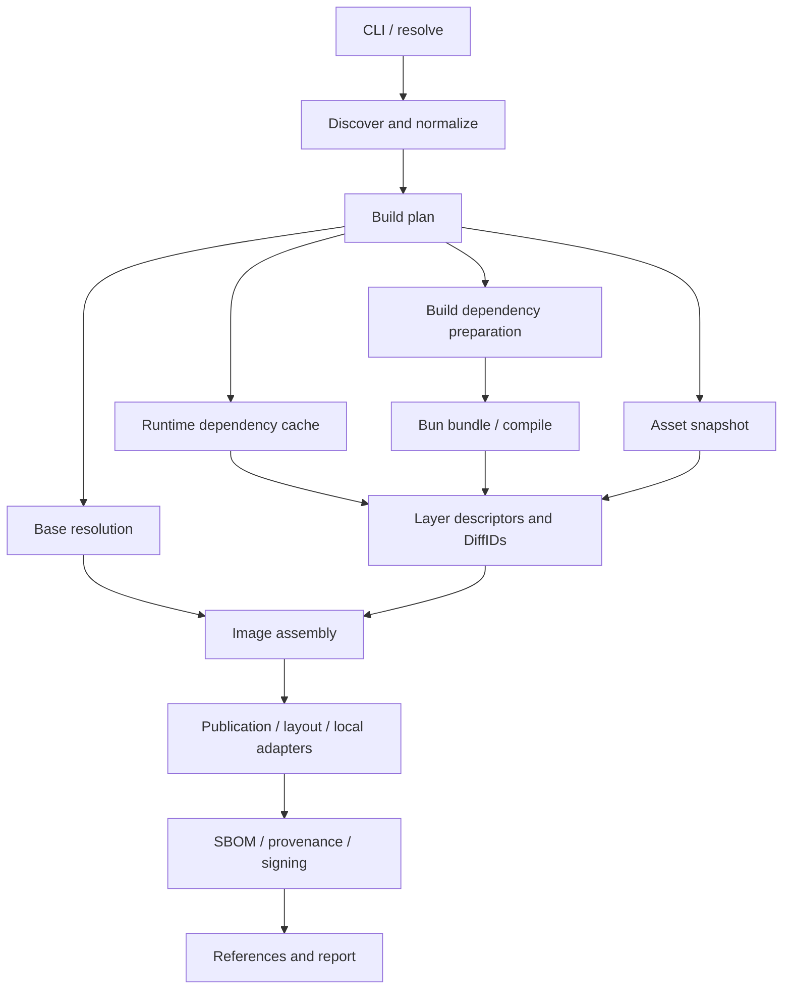

# bunko detailed design

2026-09-07. Based on the [original v0.1 proposal](archive/SPEC-v0.1.md). **M0a, M0b, M1, and M2 are implemented; M3 and later remain proposals.**

The archived proposal is now available in English; its original bytes remain in Git history. [SPEC.md](SPEC.md) is the authoritative implemented contract. This document also includes future contracts, so implementation differences and SPEC.md take precedence. [VALIDATION.md](VALIDATION.md) records observed behavior and outstanding checks.

## 1. Core design

bunko turns Bun outputs into reusable OCI layers and publishes them. Bun owns bundling and dependency resolution; bunko owns placement, determinism, image composition, and transfers.

The primary target is a TypeScript/JavaScript server such as a Bun.serve application. Default bundle mode leaves the Bun runtime in the base, limiting source-triggered rebuilds to JavaScript and emitted assets.

The operational model borrowed from ko is direct toolchain use, no Dockerfile/daemon, digest references on stdout, and reuse of existing blobs. ko also distinguishes build caches from Registry blob reuse. [ko Build Cache](https://ko.build/features/build-cache/)

A dependency layer is optional. An entirely bundled app needs only base plus app. Dependency updates changing a bundle are intentional; externalizing every npm package is not the default.

## 2. Corrections to the original proposal

| Original proposal | Problem | Adopted direction |
| --- | --- | --- |
| Same source/lock/bunko implies the same digest | Base tags, Bun, config, Git labels, and compression also affect bytes | Explicit reproducibility contract in §3 |
| Follow oven/bun:1-distroless on every build | Build/runtime Bun versions may differ | Match the selected exact toolchain and record digests |
| package.json alone is enough, but a lock is mandatory | Conflicting zero-config assumptions | No extra bunko config required; source, necessary lock, and destination are required |
| Install an external-only manifest with the original lock | Changes workspace, peer, and override resolution | Frozen install of original manifests |
| Cache hits need no install or node_modules | Ordinary bundled dependencies are still build inputs | Separate build and runtime preparation |
| Automatically externalize unresolved imports | Turns typos and missing installs into runtime failures | Fail unresolved builds |
| Externalize every trustedDependency | Script permission does not imply runtime necessity | Use only as diagnostic evidence |
| Rename all app output to index.js | Can break maps, HTML, and chunks | Keep Bun output names and the real entrypoint |
| Empty cache config | Cannot recover DiffIDs or compatibility | Versioned typed cache metadata |
| Always create a /bunko-cache repository | Adds naming, permission, and provisioning constraints | Reserved tags in the output repository by default |
| Use the top layer of deps-from images | node_modules may span layers or depend on lower contents | Dedicated dependency artifact contract |
| Generic DELETE fallback | Tag and manifest deletion have different effects | Operate only on owned cache records; never delete blobs |
| SBOM defaults true before implementation | Early CLI cannot meet the promise | Reject before M3; introduce defaults when implemented |
| Finish every investigation before M0 | Unrelated musl/provider research delays hello | Gate each feature with its required validation |

## 3. Reproducibility contract

### 3.1 Source and image digests

A source digest identifies input files. An image digest identifies the actual config, layers, and platform structure. Updating the runtime base changes the image even with unchanged source.

```text
Identical input snapshot
+ identical resolved dependency graph and package contents
+ identical exact Bun version and revision
+ identical bunko build and pack format
+ identical platform-specific base manifest digests
+ identical effective config, build defines, and SOURCE_DATE_EPOCH
+ identical embedded Git metadata
=> identical platform manifest and image index digests
```

The snapshot includes entrypoints, source, assets, manifests, referenced tsconfigs, workspace source, and patches. An initially broad source set is acceptable; mtimes and absolute checkout paths are not identity inputs.

Default Git metadata includes the full revision and dirty status. Thus identical files in different commits may have different image digests. `--git-metadata=false` omits automatic Git inputs from tags, labels, and future provenance. Dirty builds are also identified by snapshot digest.

### 3.2 Exclusions

Publication time, duration, Registry tokens, signature time, and provenance invocation IDs do not enter image config/index identity. Store real-time information in separate artifacts or local reports. Cache creation timestamps must not affect runnable image digests.

Macros, arbitrary plugins, and scripts can read uncontrolled state. Initially reject macros/plugins and disable install scripts. Packages requiring generation need explicit external artifacts.

### 3.3 Normal and strict builds

Resolve base tags once per invocation. `--reproducible` requires an explicit digest or a future bundled catalog's pinned digest. Missing catalog entries must require an explicit digest. The current implementation has no catalog and also accepts a complete local base layout.

`--verify-deterministic` builds twice in independent staging before publication and compares outputs, DiffIDs, compressed digests, configs, and manifests. Reusing one cached blob for both attempts is not verification. Complete all selected targets before pushing.

## 4. CLI and configuration rules

### 4.1 Precedence

The proposed scalar precedence is CLI > corresponding BUNKO_* variable > target bunko > root bunko.defaults > internal defaults. Root application settings must not be inherited wholesale. Current M2 does not implement root defaults; see SPEC.md.

The future merge model overrides env/labels/build.define per key and replaces assets/external/platforms/args arrays, including explicit empty arrays. Any future detected externals join afterward. Unknown keys and unavailable flags fail; current externals are explicit.

```jsonc
{
  "bunko": {
    "enabled": true,
    "imageName": "api",
    "entrypoint": "src/server.ts",
    "runtime": { "bunPath": "/usr/local/bin/bun", "libc": "glibc" },
    "deps": { "strategy": "production" }
  }
}
```

imageName separates package and publication names. M1 adds production dependencies; M2 adds closure. runtime.libc is a dependency-preparation contract, not proof that a base has been inspected.

### 4.2 Targets and naming

Keep entrypoint precedence; multiple bin entries require an explicit choice. A broken declared entrypoint fails. Do not interpret scripts.start shell commands.

Projects with dependency declarations need a root text bun.lock. A dependency-free standalone package can use an internally empty graph and skip installation. Do not convert bun.lockb or rewrite user locks automatically.

Normalize @scope/api to scope-api; fall back to the package directory basename. Validate OCI repository components and fail publication-name collisions before pushing. Resolve them with imageName, not a machine-path suffix.

--repo is a prefix without tag/digest. --bare uses an exact repository for one target. Do not provision provider repositories/namespaces.

Root discovery excludes enabled:false and prefers children with explicit bunko config; otherwise use bin/module children. No candidates is an error. Explicit member selection takes precedence.

### 4.3 Output modes

| Mode | Operation | Stdout |
| --- | --- | --- |
| Default | Registry push | repo/name@sha256:... |
| --push=false --oci-layout | Complete layout | Empty; destination goes to stderr/report |
| --push=false --tarball | Docker archive | Empty |
| --local / --kind | Load one platform | Verified content tag |
| --dry-run | Prepare, look up caches, build as needed, estimate | Empty; details go to stderr/report |

--push=false alone needs an output destination. Local and kind are mutually exclusive and disable push. Layout/tarball export may accompany push but must fetch all referenced bodies.

Default platform remains linux/amd64 even for local/kind; selecting another platform is explicit. Tarball initially supports one target/platform. Multi-target layouts reference each target root from index.json.

Docker import may not preserve a remotely addressable index digest, so local output returns a verified content tag. A future loader can extend that contract.

Dry-run performs no Registry POST/PUT/DELETE, signing, or local loading, but may read the network and build in temporary directories. A proposed --plan-only would mark uncomputed sizes/digests as unknown; it is not implemented.

Explicit tags replace defaults. Otherwise use latest and the short Git SHA, with -dirty when needed. Emit one digest per target regardless of tag count. Prefer a structured --report before adding another stdout format.

## 5. Architecture and boundaries



Separate pure planning/composition from executors that perform network, subprocess, and filesystem operations.

```ts
type Digest = `sha256:${string}`;
type Platform = { os: "linux"; architecture: "amd64" | "arm64"; variant?: string };
type Descriptor = { mediaType: string; digest: Digest; size: number };
type BlobSource =
  | { kind: "local"; path: string }
  | { kind: "remote"; registry: string; repository: string };
interface LayerRef {
  kind: "deps" | "assets" | "app";
  descriptor: Descriptor;
  diffId: Digest;
  sources: BlobSource[];
  inputKey?: Digest;
}
interface BuildPlan {
  schemaVersion: 1;
  targetId: string; // Workspace-relative path.
  toolchain: { version: string; revision: string };
  platforms: Platform[]; // Normalized, unique, stable order.
  sourceSnapshot: Digest;
  effectiveConfig: ResolvedConfig;
  dependencyPlan: DependencyPlan;
  baseByPlatform: ResolvedBase[];
  output: OutputPlan;
}
interface BuildResult {
  targetId: string;
  platformManifests: Descriptor[];
  root: Descriptor; // Usually an image index.
  publishedRef?: string;
  artifacts: Descriptor[];
  transfer: TransferStats;
}
```

These types illustrate boundaries, not a stable public API. Individual modules own types such as ResolvedConfig. Blob sources allow assembly from descriptors without eagerly downloading cached layers.

| Module | Owns | Does not own |
| --- | --- | --- |
| oci/reference | Reference parsing/normalization | Target naming |
| oci/auth | Docker credentials, scopes, expiry | Build config |
| oci/registry | Distribution HTTP | Meaning of cache hits |
| oci/tar, blob-store | Packing, hashing, streaming, CAS | npm closure |
| oci/image, layout | Manifest/config/index validation and export | Bun execution |
| bunko/project, config | Discovery and effective config | Uploads |
| bunko/lockfile adapters | Versioned schema/graph adaptation | Independent semver resolution |
| bunko/toolchain | Bun selection, arguments, execution, outputs | Image naming |
| bunko/deps | Build/runtime preparation and projection | Registry authentication |
| bunko/cache | Keys, records, hits/misses | Tar implementation |
| bunko/build | Coordination, cancellation, results | HTTP endpoint construction |
| bunko/attest | Inventory artifacts and cosign | Runnable image config changes |

Initially distribute one bunko package. Keep packages/oci internal until its API warrants separate publication.

## 6. Build and runtime dependencies

### 6.1 Separate preparation

| Kind | Inputs | Execution environment | Image contents |
| --- | --- | --- | --- |
| Build | Bundled dependencies, needed dev dependencies, workspace source | Host staging | Only emitted bundle code |
| Runtime | Externals and required transitive/native files | Separate target staging | Dependency layer |

Do not trust checkout node_modules. Freeze installs from copied manifests/locks without changing the user's tree. Bun's package cache can accelerate host preparation. A runtime cache hit does not remove the need for build dependencies; production can skip target runtime materialization.

Recreate workspace-relative topology under an invocation temporary root. Exclude .git, node_modules, bunko caches/outputs, .env*, and credentials. Include existing generated source, but do not automatically execute prepare/build/prisma generate.

Install authentication is a separate input from source. Credentials never enter images, cache metadata, or reports. Nonsecret registry/linker settings affecting resolution enter relevant fingerprints.

### 6.2 External classification

Explicit external settings are the primary input. Native-file scans provide diagnostics; a macOS tree cannot prove Linux runtime dependencies.

| Case | Treatment |
| --- | --- |
| Ordinary static JS import | Bundle |
| Explicit package/subpath external | Add its package root |
| Runtime binary such as .node | Candidate external; verify target contents |
| Platform optional prebuilt package | Support only when ready without scripts |
| postinstall download, node-gyp, generated engine | Unsupported without an adapter/artifact |
| Unresolved static import | Build failure |
| Computed require/import | Initially reject; future explicit contracts may permit |
| node:/bun: builtin | Runtime builtin, not npm dependency |
| Workspace/file/link external | M1 rejects; M2 adds workspace snapshots only |

External package internals bypass bundling, so validate their peer/optional graph. Do not claim sharp or Prisma support from package names alone. trustedDependencies is diagnostic, not an externalization rule.

### 6.3 Lock adapters

Parse JSONC using [Bun.JSONC.parse](https://bun.com/reference/bun/JSONC/parse), not regex stripping or eval. Parsing syntax does not establish graph correctness. Gate known lockfileVersion/config structures through adapters; reject unknown schemas. Discover workspace membership from manifests/files and cross-check the lock.

Graph nodes are concrete resolved instances, including aliases, duplicate versions, integrity, patches, peer contexts, local sources, and platform constraints. Edges retain requester, specifier, and destination instance. [Bun isolated installs](https://bun.com/docs/pm/isolated-installs) use stores and links, so copying node_modules by a set of names is insufficient.

### 6.4 M1 production strategy

No externals means no dependency layer. Otherwise retain original manifests/lock/patches and package the full production tree. Some bundled code is duplicated, but source-only layer reuse remains correct.

```text
bun install --production --frozen-lockfile --ignore-scripts
            --os=linux --cpu=x64|arm64 --linker=isolated
```

This is an argument outline; validate actual linker/config behavior on the pinned Bun. Independently verify manifest/lock consistency rather than relying on frozen-lockfile alone. [--os/--cpu](https://bun.com/docs/pm/cli/install#platform-specific-dependencies) select packages; they do not make Linux install scripts executable on macOS.

M1 initially supports standalone registry packages that need no scripts on glibc targets. Inspect native architecture/libraries and validate runtime on Linux.

### 6.5 M2 closure and workspaces

Follow the concrete graph from Bun's original-condition Linux install; do not resolve a reduced manifest or implement semver selection. Project entire package directories, resolution links, required peer/optional packages, and .bin links. Keep READMEs/licenses; generated packages require a producer artifact.

Include placement and link destinations in layout identity. Identical name/version sets with different peer contexts are not interchangeable. Preserve each edge's original destination instance.

Bundle workspace packages by default. External workspace snapshots include package bytes and safe image-relative links, so changes invalidate runtime dependencies.

sharedDeps projects the union of selected graphs. It intentionally adds dependencies some targets do not need. Keep version/peer contexts distinct and reject cases where per-target resolution cannot be preserved.

## 7. App and assets

### 7.1 One selected toolchain

Select Bun once for install/build and record its full version/revision; the CLI's runtime may differ. --bun-path overrides the choice. Spawn argv directly, route child logs to stderr, and identify results from the metafile/output tree instead of parsing log text.

A future compiled CLI can embed its own runtime but still needs a separate project build/install Bun until embedded-toolchain execution is implemented and verified.

### 7.2 Bundle

Defaults: target=bun, format=esm, minify=true, sourcemap=none, bytecode=false, packages=bundle, env=disable, explicit NODE_ENV=production. Do not depend on implicit production behavior. Require --reject-unresolved support and keep runtime env separate from build.define.

Canonicalize staging cwd/outdir and use a reserved output directory inside the snapshot, not the checkout. Normalize sourcemap sources and verify they contain no machine-specific paths.

Keep [dir]/[name].[ext] naming. Select the server JS corresponding to the source entry from the metafile. Preserve HTML, chunks, file-loader assets, and maps as one tree; never rename all output to index.js. [Fullstack bundling](https://bun.com/docs/bundler/fullstack#ahead-of-time-bundling-recommended) needs HTTP checks for referenced JS/CSS as well as server startup.

Ordinary ESM can share identical outputs across platforms, but a JS extension alone does not prove portability. Host native modules, platform-sensitive macros/plugins, and generated host code are outside that contract.

Bytecode remains unsupported. Bun 1.3.11 fixtures embedded absolute paths in CJS wrappers and differed across checkouts. Future support needs path and exact-runtime validation; architecture portability does not prove reproducibility or cross-version compatibility. [Bun bytecode](https://bun.com/docs/bundler/bytecode#versioning-and-portability)

### 7.3 Compile

Map OCI amd64 to Bun x64 and use a versioned target table. Do not invent unverified CPU/musl strings. [Executable targets](https://bun.com/docs/bundler/executables)

Initially restrict compile to projects without externals. Native modules, dynamic data access, and generated engines may still need files. Inspect ELF interpreters/shared libraries and run every target on its declared base before claiming support. Catalog verified distroless cc digests. A musl target alone does not establish scratch/static compatibility.

### 7.4 Assets

Resolve patterns against the target root and fail unmatched patterns. Preserve explicitly included hidden files while retaining reserved secret exclusions. Normalize POSIX relative paths and reject absolute paths, traversal, NUL, duplicates, and case collisions. Future symlink support must validate reachability, cycles, and dangling links; M2 rejects source symlinks.

App/assets/deps file collisions fail; repeated directory creation may be shared. Include destination prefixes in cache keys when workdir changes.

## 8. Layers and image configuration

### 8.1 Pack format v1

Normalize timestamps, ownership, modes, and gzip headers. Paths have no leading slash or ./; create parents once and sort by UTF-8 bytes. Emit regular files, directories, and relative symlinks. Read hardlinks as regular contents and omit devices/FIFOs/sockets/setuid metadata.

Use deterministic PAX ordering/names/lengths when ustar cannot represent paths, links, or numbers. Long npm-store paths are routine. End tar with two 512-byte zero blocks. Bind compressor implementation/version/level to pack format. Stream both hashes to a temporary compressed file and atomically publish to CAS; retry uploads from that file rather than retaining entire tar streams in memory.

[DiffID](https://github.com/opencontainers/image-spec/blob/v1.1.1/config.md#layer-diffid) is the uncompressed tar hash, not the compressed layer descriptor digest. Freeze changed inputs as a coherent snapshot or fail; never publish a key computed from different bytes than those packed. Mtime/size alone are insufficient.

### 8.2 Configuration composition

| Field | Rule |
| --- | --- |
| architecture/os/variant | Match selected platform and reject incompatible bases |
| rootfs.diff_ids | Append only actual new layer DiffIDs |
| history | Preserve order and empty_layer; append one entry per new layer when history exists |
| Entrypoint | Bundle: [bunPath, absoluteEntry]; compile: [absoluteBinary] |
| Cmd | args or []; never retain the base command |
| Env | Base, NODE_ENV=production, user overrides; sorted keys |
| WorkingDir | Explicit or /app, not inherited from base |
| User | Explicit, then nonempty base user, then 65532:65532 |
| ExposedPorts | Explicit replacement; otherwise preserve base |
| Labels | Base, user, then reserved bunko values; reject user overrides of reserved labels |
| created | Fixed UTC representation of SOURCE_DATE_EPOCH |

An explicit base root user remains root. Read-only filesystem enforcement belongs to runtime settings. bunko files remain root-owned with readable modes. Do not invent base history when absent; otherwise verify filesystem history count against DiffIDs.

Validate nonnegative epoch, normalized absolute workdir, TCP ports 1–65535, and valid env entries before Registry writes. Preserve base PATH/locale/runtime settings. Docker-only OnBuild/Healthcheck must not be silently treated as valid application behavior; field-specific handling of Volumes/StopSignal needs tests.

### 8.3 Base resolution

Resolve tag, index, platform manifest, then config, validating received bytes/size/digest. Reject absent or ambiguous platforms and bound nested-index traversal. Preserve base compressed bytes/DiffIDs without recompression. Accept OCI/Docker schema 2; normalize known media types, reject schema 1 and foreign/nondistributable layers. Canonicalize only newly generated JSON, preserving meaningful array order.

Default candidate: oven/bun:<exact toolchain version>-distroless. A Dockerfile path is not evidence about a published tag. Future catalog entries record index/platform digests, Bun, libc, and runtime verification. [Bun distroless Dockerfile](https://github.com/oven-sh/bun/blob/main/dockerhub/distroless/Dockerfile)

Custom bases use runtime.bunPath. PATH does not prove a binary exists; strict filesystem inspection requires applying [whiteouts, opaque directories, and links](https://github.com/opencontainers/image-spec/blob/v1.1.1/layer.md), with additional pull cost.

Record platform digest in org.bunko.base.digest and optional index digest in org.bunko.base.index.digest. Record unverified custom bases honestly. Output a stable-order OCI index even for one platform, unless --no-index selects one manifest.

### 8.4 Layout and archive

Layouts contain oci-layout version 1.0.0, index.json, and blobs/sha256. Include all reachable image and selected attachment blobs; descriptors without bodies are not a complete export. The layout's reference index is distinct from the published image index. Preserve published root bytes and place ref-name annotations on export descriptors only.

Docker archives are a separate serializer with manifest.json, image configs, and ordered uncompressed layer.tar files verified against DiffIDs. A tar-wrapped OCI layout is not automatically Docker-loadable. Initially decode gzip/raw layers only; reject zstd until supported. Finalize outputs atomically, never overwrite nonempty layouts, and verify loaded local/kind content tags.

## 9. Cache design

### 9.1 Keys and digests

Keys decide whether inputs permit reuse; digests identify bytes. A correct blob digest cannot repair an incomplete key.

```text
key = sha256("bunko/cache/v1\0" + canonicalJSON(CacheInputs))
```

| Input | Dependency key | Asset key |
| --- | --- | --- |
| Kind/schema/packer/compressor | Required | Required |
| Epoch/destination | Required | Required |
| Exact Bun/install policy/linker | Required | Not required |
| Lock schema/graph/resolution manifests | Required | Not required |
| External roots/strategy/layout | Required | Not required |
| Integrity/source/peers/patches | Required | Not required |
| Workspace/local package bytes | Required when supported | Required when selected |
| OS/architecture/libc/ABI | Required | Not required |
| Base digest | Conservative for native/unknown graphs | Not required |
| Paths/content/modes/links | Required for projected inputs | Required |

Production initially hashes the full lock; conservative misses are preferable to incorrect hits. The original optimization goal was to avoid installing solely to compute keys. M2 closure instead hashes the concrete projected tree and explicitly retains Linux install/graph verification on hits; see the implementation notes below.

Exclude publication repository/tag, host absolute paths, creation time, and credentials. Different install layouts have different identity even with the same package set.

### 9.2 Cache artifact v1

Use full, untruncated keys in bunko-cache-v1-<kind>-<64 hex> tags, defaulting to the image repository. BUNKO_CACHE_REPO may select a shared repository; another Registry requires transfers because mounts cannot cross Registries.

```jsonc
// Illustrative boundary; SPEC.md describes the implemented record shape.
// Config: application/vnd.bunko.cache.config.v1+json
{
  "schemaVersion": 1,
  "key": "sha256:<full-key>",
  "kind": "deps",
  "packFormat": "bunko-tar-gzip-v1",
  "platform": { "os": "linux", "architecture": "amd64" },
  "diffId": "sha256:<uncompressed-tar>",
  "destination": "/app/node_modules",
  "inventory": []
}
```

The OCI manifest has artifactType application/vnd.bunko.cache.v1, a custom config, and one gzip layer. Inventory supports later SBOM work without reinstalling solely for that purpose; assets use null platform. [OCI artifact guidance](https://github.com/opencontainers/image-spec/blob/v1.1.1/manifest.md#guidelines-for-artifact-usage)

A future creation timestamp belongs to cache management, not runnable image identity. M2 does not record one. Invalid schemas, keys, layer counts, or descriptors cause diagnostic misses; cache publication failure is a warning.

### 9.3 Lookup and materialization

1. Read and verify the local key record and blob.
2. Otherwise fetch and validate remote manifest/config; HEAD is not mandatory first.
3. Return a lazy layer reference on hit; fetch the body only for fallback publication or export.
4. Materialize/pack on miss, subject to the documented closure planning behavior.
5. After preparing destination blobs, attempt cache publication separately.

Read-only cache access is useful; cache write denial must not invalidate image success. Target publication/auth failures are fatal. Use invocation-local single flight where implemented and share only complete CAS blobs/atomic records across processes. Future concurrency must stop on nondeterministic outputs for the same key.

### 9.4 Local cache and pruning

Use `${XDG_CACHE_HOME:-~/.cache}/bunko/v1/` with separate blobs/sha256 and keys/<kind>/<hex>.json paths. Incomplete files are not hits. Invalid blobs miss. Disabling persistent local caching does not eliminate temporary upload blobs. Bun's download cache remains separate.

Future remote pruning paginates tags and selects only owned prefixes with matching schemas. Creation time is not last-use time. Distinguish tag deletion from manifest deletion and account for other tags sharing a digest. Do not automatically fall back to generic manifest deletion and never delete blobs. Reclaimed space depends on provider retention/GC. [OCI content management](https://github.com/opencontainers/distribution-spec/blob/v1.1.1/spec.md#content-management)

## 10. Registry client and publication

### 10.1 Authentication

Config precedence: BUNKO_DOCKER_CONFIG file, DOCKER_CONFIG/config.json, then ~/.docker/config.json. Credential precedence: per-host helper, global store, then auths. Selected-helper failures do not fall back to stale credentials. [Docker credential stores](https://docs.docker.com/reference/cli/docker/login/#credential-stores)

Normalize Docker Hub display/API/credential aliases and preserve private Registry ports. Execute helpers with argv and stdin; do not put credentials in command arguments or logs. Follow 401 Bearer realm/service/scope challenges, cache scoped tokens with expiry, and account for source pull plus destination push during mounts. [Registry authentication](https://docs.docker.com/reference/api/registry/auth/)

HTTPS is the default; current M2 requires explicit HTTP permission even for loopback. Strip Authorization across origins. Preserve absolute/relative upload Locations and their complete signed queries.

### 10.2 Blob placement

```text
HEAD destination
  200 -> reuse
  404 -> same-Registry source available?
           yes -> POST mount
                    201 -> mounted
                    202 -> continue returned upload session
           no -> POST upload session
         verified source GET if needed
         PATCH chunks -> PUT ?digest=...
```

A mount 202 is an upload session, not a reason to start another. Cross-Registry transfers require source GET plus upload. [OCI mounting](https://github.com/opencontainers/distribution-spec/blob/v1.1.1/spec.md#mounting-a-blob-from-another-repository)

First publication may also transfer the base; do not promise zero base downloads for every destination. Bound GET/HEAD retries, honor Retry-After, and back off on transient failures. Reconcile ambiguous PATCH/PUT completion through offsets/HEAD before replaying. Close incomplete upload sessions best effort.

### 10.3 Ordering and failure

Validate target configuration, names, and inputs, then construct every selected image before writes. Publish blobs/configs, platform manifests, and root indexes by digest; update tags last and verify them.

Multiple tags/targets are not transactional. Report published digests and pending tags, do not roll back existing tags, and emit ordered stdout only after the entire requested operation succeeds. Requested future attestations/signatures also gate success, with image publication possibly preceding attachment failure.

Current execution is primarily sequential. A proposed bounded scheduler would allow two builds, one install, and four blob transfers, with --jobs controlling builds. Never let platform × target × layer concurrency become unbounded or completion order affect indexes/stdout.

## 11. External dependency artifacts

--deps-from must consume a defined artifact rather than an arbitrary image's top layer. Require a self-contained gzip tar, DiffID, platform, libc/Bun ABI contract, destination, manifest/lock/patch fingerprint, and inventory. It must represent a complete node_modules addition with no lower-layer dependency or whiteouts.

BuildKit examples should prepare dependencies on the target platform, then export just the dependency tree or use a dedicated packer. Record the producer artifact digest in provenance. Cache identity includes producer contract version and external artifact digest, distinct from ordinary installation. Extracting dependencies from arbitrary image filesystems would be a separate future feature.

## 12. SBOM, provenance, and signing

Combine conservatively reachable bundled packages from the metafile with runtime inventory, rather than listing the whole lock. Reference base SBOMs where available without claiming complete OS analysis otherwise.

Use SPDX 2.3 package name/version/purl/license/downloadLocation/checksum where known. Archive integrity is not an extracted package verification code. Unknown licenses use NOASSERTION. [SPDX package information](https://spdx.github.io/spdx-spec/v2.3/package-information/)

Attach platform SBOMs to platform manifests and index provenance to the complete platform mapping. Use artifact subjects, not runnable index children, so attachments do not alter image identity.

Use in-toto statements with SLSA provenance v1 buildDefinition/runDetails, not obsolete materials fields in a v1 predicate. Record snapshot, lock, base, external dependencies, and toolchain as resolved dependencies. Schema compliance alone does not establish a SLSA level. [SLSA provenance](https://slsa.dev/spec/v1.1/provenance)

Implement the OCI referrers tag schema when the API is unavailable. Custom .sbom tags may be additional conveniences, not discovery substitutes. Serialize same-subject fallback-index updates within an invocation and reread after writes. [OCI referrers](https://github.com/opencontainers/distribution-spec/blob/v1.1.1/spec.md#listing-referrers)

If M3 enables SBOM/provenance by default, provide explicit false options and treat required generation/attachment failure as failure. Execute cosign against immutable digests. Image signing does not imply attestation signing; verify those separately and pin supported noninteractive tool behavior.

## 13. Resolve, apply, and zero runtime dependencies

Replace complete bunko:// string scalar values, not comments, mapping keys, templates, or substrings. Use AST/CST support rather than whole-document regex replacement. Reference paths use cwd or explicit --context consistently for files/stdin/process substitution.

Parse all documents, collect references, canonicalize/deduplicate targets, build once, and emit only after success. Directory traversal is ordered and recursion explicit. Multiple JSON inputs must form valid output rather than concatenated JSON.

Zero runtime npm dependencies means the distributed CLI requires no external packages. Bundling a maintained YAML parser is allowed; writing a parser just to avoid third-party code is not a goal.

Future apply completes resolution before passing the output to kubectl apply -f -. Preserve kubectl exit status/stderr and never apply partial output after an earlier build failure.

## 14. Validation and benchmarks

### 14.1 Required fixtures

| Area | Properties |
| --- | --- |
| tar/gzip | Ordering, modes, links, PAX, epoch, both hashes |
| config/index | Base env, cleared Cmd, history, platform order, canonical JSON |
| Registry | 401/expiry, mounts 201/202, redirects, 429, resumed uploads, digest/size mismatch |
| Cache | Epoch/workdir/patch/peer/Bun invalidation, unrelated source hits, corruption/concurrency |
| Dependencies | Duplicate versions, aliases, peers, platform optional packages, workspace links |
| Bundle | Different checkout/outdir paths, minification, import.meta, assets/maps |
| HTML | HTML/JS/CSS responses, emitted paths, unique server entry |
| Runtime | Supported Linux platforms, SIGTERM, nonroot, read-only rootfs and /tmp |
| Resolve | Multiple documents, comments, anchors/aliases, stdin, deduplication, empty stdout on failure |

Mocks inject protocol failures; real Registry-to-pull-to-run tests guard against client/mock agreement on the same mistake. Docker in tests does not compromise daemonless production builds.

### 14.2 Comparison conditions

Do not assume buildx always downloads cache layers or that bunko is always smaller. Publish concrete configurations and measurements. [Docker Registry cache](https://docs.docker.com/build/cache/backends/registry/)

Compare Bun bundle and compile multi-stage Dockerfiles, bundle plus buildx Registry cache, and bunko modes separately. Align Bun/base/platform/dependencies/maps/minification/compression and attachment features.

| Scenario | Measurement |
| --- | --- |
| All caches cold | Initial install, base transfer, publication |
| All caches warm, unchanged | Remaining builds and uploads |
| New runner, remote cache warm | Registry reuse versus build dependency preparation |
| One meaningful source-line change | App/config/manifest/index transfers |
| Assets/dependencies/base changed separately | Expected invalidation |
| Unsupported mounts or another Registry | Fallback ingress/egress |
| Different checkout, identical pinned inputs | Reproducibility |

Measure layer/metadata/attestation uploads, downloads, reused blobs, and mounted blobs separately. Wire bytes including headers/retries are another metric. Publish repeated-run median/range, versions, and cache state. App-only layer changes still require new configs/manifests/indexes and possibly attachments. A whitespace change eliminated by tree-shaking is not a representative edit.

## 15. Implementation order and completion gates

| Milestone | Scope | Completion gate |
| --- | --- | --- |
| S0 | Toolchain adapter, base candidates, tar fixtures | Understand pinned Bun output and validate base config/startup |
| M0a | Config, discovery, bundle/assets, packing/composition/layout | Independent pinned staging outputs match |
| M0b | Auth, blobs/manifests, one-platform index, push | Real Registry hello pull/run and digest-only stdout |
| M1 | Production dependencies, local/Registry cache, multi-platform, local/kind | Source edits upload no deps/assets; native Linux fixture runs |
| M2a | Root lock, multiple targets, production workspace tree | Preserve versions/peers and run two services on both platforms |
| M2b | Concrete closure, sharedDeps, focused keys | Reduced dependencies preserve runtime resolution |
| M2c | YAML/JSON resolve | Multiple documents and duplicate targets, output only on success |
| M3 | Distribution/Actions, SBOM/provenance/signing, check-base, compile | Schema/signature checks, platform startup, distribution smoke |
| M4 | External deps artifacts, apply, prune, additional Registries | Interoperability for imported dependencies and deletion contracts |

HTML output was investigated in S0; runtime support claims require HTTP tests. Bytecode/musl experiments do not block M0.

The first PR grew from M0a through M1, including real Distribution reuse/pull/run, source-edit upload checks, both native platforms, archives/local loading, and kind image inspection. Cloud auth patterns passed tests; cloud account pushes were not verified.

### M1 implementation differences

Production dependencies and explicit externals shipped first. Native inspection records ELF/DT_NEEDED and requires an explicit suitable base; general ABI validation remains M3. HTTP always requires explicit host permission. Cache artifacts use full keys but have no creation time, pruning, or process lock. Transfers use 8 MiB chunks and execution is primarily sequential; --jobs is unavailable. Reports count payloads, not complete wire/metadata totals. Scripts, source links, computed application imports, and macros are rejected. Standalone lock adaptation handles patches, optional peers, and overrides. See the [provider matrix](REGISTRIES.md) for unverified service behavior.

### M2a implementation differences

The workspace production tree lives under .bunko-workspace with service-specific external links and preserved Bun topology. Validate all member manifests and lock metadata. Keys include all relevant manifests, the full lock, layout version, target path, and runtime workspace source. The complete workspace snapshot remains the source digest, so unrelated edits can alter other image configs.

Targets can be discovered or selected by name/path/member directory. Multi-target reports use schema 3, single targets remain schema 2. Build every target before side effects; partial tags remain visible in reports. Root-only npmrc/overrides/patches and positive relative globs are supported; nested/object/catalog/file/link forms remain unsupported.

## 16. Remaining decisions and risks

| Topic | Direction | Decision point |
| --- | --- | --- |
| Supported Bun minimum | Validate exact releases; do not assume latest docs match 1.3.11 | Release matrix |
| Base pinning | Ship a versioned digest catalog or require explicit bases | Catalog implementation |
| Dependency size | Production first, closure in M2 | Implemented |
| Install scripts | Disabled; external artifacts for generation | Adapter design |
| Frontend frameworks | Support standard Bun builds; no guessed framework commands | Each example |
| YAML parser | Bundle at build time | Implemented |
| Cache artifacts | Cache failure may fall back while image publication proceeds | Each Registry |
| Cache tag growth | Same-repository default, explicit shared repository, retention examples | Pruning work |

The major risk is preserving Bun runtime resolution while cutting dependency trees, rather than composing OCI JSON. Build value incrementally and expand projection fixtures before broad compatibility claims.

### M2b implementation choice

Project the actual Linux instance graph and place target aliases in app layers to share a common dependency layer. Hash projected bytes/modes/paths/edges instead of interpreting a lock subset. Unrelated lock edits can reuse the layer, but closure hits still perform Linux install/graph verification. Production keeps its install-skipping behavior. See [SPEC §9](SPEC.md#9-dependency-closure-and-shareddeps-m2b).

### M2c implementation choice

Use yaml 2.9.0 AST/CST ranges to replace values while preserving source text. Separate prepare from finish across contexts so every build and output validation completes before publication. Resolve is Registry-only; dry-run/local/apply combinations are unavailable. Multiple JSON inputs become an array. See [SPEC §10](SPEC.md#10-resolve-m2c) and the [parser API](https://eemeli.org/yaml/).
