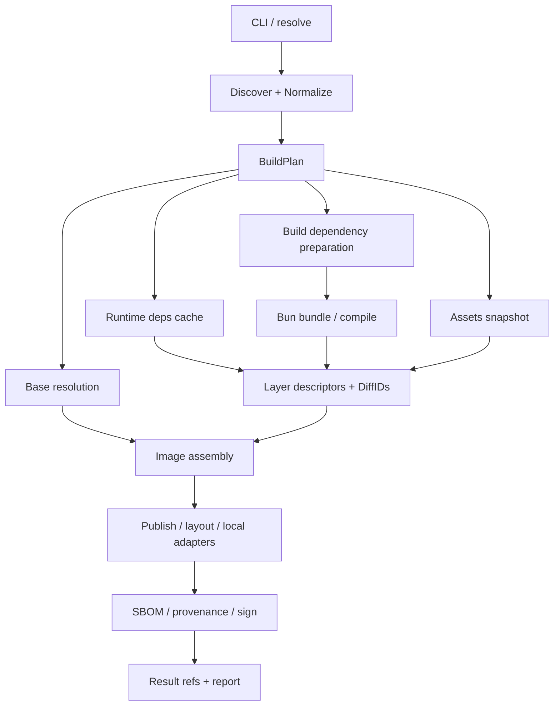

# bunko 詳細設計案

2026-09-07。対象: [元仕様 v0.1](archive/SPEC-v0.1.md)。状態: **M0a を実装、後続は設計案**。

元の仕様書は archive に入力ファイルのまま保存している。M0a で採用した変更と実際の対応範囲は [現行実装仕様](SPEC.md) に統合した。本書の後続 milestone は実装済みの機能を意味しない。実機で確認した結果と残る検証は [VALIDATION.md](VALIDATION.md) に分けた。

## 1. 設計の中心

bunko は **Bun の成果物を、再利用できる OCI レイヤーにして公開するツール**とする。Bun が bundle と依存解決を担当し、bunko がファイル配置・決定性・イメージ構成・転送を担当する。

最も扱いやすい対象は、`Bun.serve()` などで起動する TypeScript/JavaScript サーバー。既定の bundle モードで Bun 本体を base に残し、ソース変更で作り直す範囲を JS とその生成物に限定する。

ko から引き継ぐのは、ツールチェーンの直接利用、Dockerfile/daemon 不要、digest 参照の標準出力、既存 blob の再利用という操作モデル。ko 自身もビルドキャッシュと registry の blob 再利用を分けている。[ko Build Cache](https://ko.build/features/build-cache/)

**deps レイヤーを常に作る必要はない。** 全依存を bundle できるアプリなら、`base + app` だけで成立する。npm 依存の更新で bundle が変わるのは意図した動作であり、「すべての npm 依存を別レイヤーにする」は既定にしない。

## 2. 元の仕様から先に直す点

| 元の仕様 | 問題 | 採用案 |
| --- | --- | --- |
| 同じソース・lock・bunko で同じ digest | base tag、Bun、設定、Git label、圧縮器も出力を変える | 再現性の入力契約を §3 に定義 |
| `oven/bun:1-distroless` を毎回追従 | ビルドする Bun と実行する Bun がずれる | toolchain の完全バージョンに対応する base を既定候補にし、digest を記録 |
| package.json だけで動く / bun.lock 必須 | ゼロ設定の前提が矛盾 | 追加の bunko 設定は不要。ソース・必要な lock・push 先は必要 |
| external だけの package.json と元の lock で install | workspace、peer、override などの解決条件が変わる | 元の manifest 群を維持した frozen install から始める |
| cache hit なら install も node_modules も不要 | bundle する通常依存はビルドに必要 | build dependencies と runtime dependencies を分ける |
| `Could not resolve` を自動 external 化 | typo や未インストールを実行時障害に変える | 自動リトライを廃止し、解決できなければ失敗 |
| `trustedDependencies` を全部 external 化 | script 実行の許可と runtime 必要性は別 | 診断材料に限定し、external の根拠にしない |
| app 出力を `index.js` に rename | sourcemap、HTML、chunk の参照が壊れ得る | Bun の出力名を維持し、実際の entrypoint を config に設定 |
| cache config は `{}` | DiffID や再利用条件を復元できない | 型と version を持つ cache config を保存 |
| cache repo は常に `<repo>/bunko-cache` | repository 数・作成権限・命名制約を増やす | 既定は出力 repository 内の予約 tag。共有先は環境変数で指定 |
| deps-from の最上位レイヤーを採用 | node_modules が下層や複数レイヤーにあると破損 | 専用の deps artifact 契約を作る |
| DELETE 非対応を汎用フォールバック | tag 削除と manifest 削除で影響が違う | 自分の cache 記録だけ扱い、blob を削除しない |
| `--sbom` 既定 true だが M3 実装 | 初期 CLI が約束を満たせない | M3 より前は未対応オプションとして拒否。M3 で既定を導入 |
| 全調査を M0 の前提にする | musl や全 registry の調査で hello が遅れる | 実装する機能ごとに検証をゲート化 |

## 3. 再現性の契約

### 3.1 二つの digest を区別する

`source digest` は入力ファイル集合を表す。`image digest` は config・レイヤー・platform 一覧など、実際に公開する OCI オブジェクトを表す。同じソースでも runtime base が更新されれば別の image になる。

再現性の保証は次の条件とする。

```text
同一の入力スナップショット
+ 同一の解決済み依存グラフ・package 内容
+ 同一の Bun 完全バージョン / revision
+ 同一の bunko ビルド・pack format
+ 同一の platform 別 base manifest digest
+ 同一の有効設定・build-time define・SOURCE_DATE_EPOCH
+ 同一の image に埋め込む Git metadata
=> 同一の platform manifest / image index digest
```

入力スナップショットには entrypoint、到達するソース、assets、package.json、tsconfig の extends 先、workspace ソース、patch ファイルを含む。初期実装ではソース集合を広めに取ってよいが、mtime や絶対 checkout パスは入力 identity に使わない。

Git revision label は既定で現在の full SHA を含め、dirty 状態も記録する。このため同一ファイルでも commit が違えば image digest が変わる。`--git-metadata=false` を追加し、Git 情報をタグ・label・provenance の自動入力から外せるようにする。dirty なビルドは source snapshot digest でも識別する。

### 3.2 再現性の対象外

公開時刻、所要時間、registry token、署名時刻、provenance の invocation ID は image config/index に入れない。実時間が必要な情報は別 artifact またはローカルレポートに保存する。cache 記録の作成時刻も image digest に影響させない。

macros、任意 plugins、install scripts が外部状態を読む場合は上の契約を自動では満たせない。初期実装では macros/plugins を非対応とし、install は scripts 無効を既定とする。scripts が必要なパッケージは明示的な外部生成物に分離する。

### 3.3 通常ビルドと厳密な再現

通常ビルドでは base tag を invocation 内で一度だけ解決する。`--reproducible` では利用者指定 base に digest を要求し、bunko 同梱の既定 base catalog を使う場合も固定 digest を使う。対応バージョンの catalog がなければ、明示的な base digest を案内する。

`--verify-deterministic` は公開前に別 staging directory で二度作成し、出力 tree、DiffID、compressed digest、config、manifest を順に比較する。cache hit で両方を同じ blob にする検証は禁止。全 target の照合が完了してから push する。

## 4. CLI と設定の確定ルール

### 4.1 優先順位

scalar は `CLI > 対応する BUNKO_* 環境変数 > target の bunko > root の bunko.defaults > 内部既定値`。root の `bunko` を各子 package へ丸ごと継承しない。root の entrypoint や assets を誤って子に適用するのを防ぐ。

`env`・`labels`・`build.define` は key ごとに上書き。`assets`・`external`・`platforms`・`args` は上位の配列で置換し、自動 external の検出結果だけ最後に和集合にする。空配列も明示的な設定として扱う。未知の設定 key と未実装 flag はエラー。

追加する設定は次の範囲に絞る。

```jsonc
{
  "bunko": {
    "enabled": true,
    "imageName": "api",
    "entrypoint": "src/server.ts",
    "runtime": {
      "bunPath": "/usr/local/bin/bun",
      "libc": "glibc"
    },
    "deps": { "strategy": "production" }
  }
}
```

`imageName` は package 名と公開名を分けるための escape hatch。`deps.strategy` は M1 で `production` のみ、M2 で `closure` を追加する。`runtime.libc` は任意 base の依存準備に使う契約であり、base を検査した証明ではない。

### 4.2 target と名前

entrypoint の優先順位は元の仕様を維持する。`bin` object が複数なら明示指定を要求する。設定されたパスが存在しない場合、下位候補に黙って落とさない。`scripts.start` の shell command は解析しない。

依存宣言があるプロジェクトでは root の text `bun.lock` を必須にする。依存宣言がまったくない単一 package だけは lock なしを許し、空の依存グラフを内部生成して install を省略する。`bun.lockb` の自動変換や利用者の lock の書き換えはせず、変換手順を案内する。

既定 image 名は package 名から `@scope/api -> scope-api` と変換し、OCI repository の component として検証する。名前がなければ package の directory basename。異なる target が同じ公開名になれば push 前にエラーとし、`imageName` で解消する。絶対 checkout パスによる suffix は付けない。

`--repo` は tag/digest を含まない repository prefix。`--bare` は単一 target に限定し、その値を正確な出力 repository とする。registry 固有の repository 作成や namespace 作成は行わない。

workspace root の自動選択は、`enabled:false` を除き、明示的な `bunko` を持つ子があればその集合を採用。なければ `bin` / `module` を持つ子を候補にする。候補ゼロを成功扱いしない。明示 path は自動選択より優先する。

### 4.3 出力方式

| 指定 | 実行内容 | stdout |
| --- | --- | --- |
| 既定 | registry push | `repo/name@sha256:...` |
| `--push=false --oci-layout DIR` | layout を作成 | 空。成果物パスは stderr / report |
| `--push=false --tarball FILE` | Docker archive を作成 | 空 |
| `--local` / `--kind` | 単一 platform の archive をロード | 検証済みの content tag |
| `--dry-run` | 計画・cache lookup・必要な build・転送見積もり | 空。計画は stderr / report |

`--push=false` だけなら出力先不足でエラー。`--local` と `--kind` は排他で、registry push を無効にする。layout / tarball は push と併用できるが、全 blob を手元へ取得する必要がある。

単一 platform の既定値は元仕様どおり `linux/amd64`。local/kind も自動的に host platform へ切り替えず、異なる platform をロードする場合は明示指定を使う。`--tarball` は初期版では単一 target / platform に限定する。複数 target の layout は一つの `index.json` から target ごとの root descriptor を参照する。

ローカル Docker archive の import で remote index digest がそのまま参照可能とは限らないため、remote と同じ digest 出力を約束しない。将来 digest 参照を保証できる loader ができたら拡張する。

`--dry-run` は registry の POST / PUT / DELETE、sign、local load を行わない。ネットワーク read や一時ディレクトリでの build はあり得る。安価な構成確認は追加の `--plan-only` で行い、未算出のサイズ・digest を `unknown` と表示する。

追加 tag の指定があればその集合を使い、なければ `latest` と Git 短縮 SHA。dirty の場合は SHA tag に `-dirty` を付ける。stdout の digest は tag 数に関係なく target ごとに一行。`--output=json` を将来追加するより先に `--report FILE` で target、platform、digest、転送量を構造化保存する。

## 5. アーキテクチャとデータの境界



全処理を純粋関数にするのではなく、**純粋な計画・構成処理と、副作用を持つ executor を分離**する。registry への fetch、Bun の実行、ファイルの読み書きは adapter に閉じ込める。

```ts
type Digest = `sha256:${string}`;
type Platform = { os: "linux"; architecture: "amd64" | "arm64"; variant?: string };
type Descriptor = { mediaType: string; digest: Digest; size: number };

type BlobSource =
  | { kind: "local"; path: string }
  | { kind: "remote"; registry: string; repository: string };

interface LayerRef {
  kind: "deps" | "assets" | "app";
  descriptor: Descriptor;
  diffId: Digest;
  sources: BlobSource[];
  inputKey?: Digest;
}

interface BuildPlan {
  schemaVersion: 1;
  targetId: string;                 // workspace 内の相対 path
  toolchain: { version: string; revision: string };
  platforms: Platform[];            // 正規化・重複排除・固定順
  sourceSnapshot: Digest;
  effectiveConfig: ResolvedConfig;
  dependencyPlan: DependencyPlan;
  baseByPlatform: ResolvedBase[];
  output: OutputPlan;
}

interface BuildResult {
  targetId: string;
  platformManifests: Descriptor[];
  root: Descriptor;                // 通常は image index
  publishedRef?: string;
  artifacts: Descriptor[];
  transfer: TransferStats;
}
```

型中の `ResolvedConfig` 等は各 module が所有する。本書の型は境界の設計であり、ライブラリ API の互換性保証ではない。`BlobSource` を持たせるのは、cache hit 時にレイヤー本体をダウンロードせず assembly できるようにするため。

| module | 責任 | 持たせない責任 |
| --- | --- | --- |
| `oci/reference` | registry/repository/tag/digest の parse・正規化 | target 命名 |
| `oci/auth` | Docker credentials・token scope・期限 | build 設定 |
| `oci/registry` | Distribution HTTP protocol | cache hit の意味 |
| `oci/tar`, `oci/blob-store` | tar/gzip/digest・streaming・CAS | npm 閉包 |
| `oci/image`, `oci/layout` | manifest/config/index 検証・出力 | Bun 実行 |
| `bunko/project`, `bunko/config` | target 発見・設定確定 | upload |
| `bunko/lockfile/*` | version ごとの lock adapter・graph | npm semver の再解決 |
| `bunko/toolchain` | Bun の選択・引数・実行・生成物検証 | image 命名 |
| `bunko/deps` | build/runtime の準備・projection | registry 認証 |
| `bunko/cache` | key、cache record、hit/miss | tar の実装 |
| `bunko/build` | DAG 実行・キャンセル・結果集約 | HTTP endpoint の組み立て |
| `bunko/attest` | inventory から artifact 作成・cosign | image config の変更 |

外部公開する npm package は最初は `bunko` 一つでよい。`packages/oci` は内部 workspace library として分け、API が安定してから独立配布する。

## 6. Build dependencies と runtime dependencies

### 6.1 二つの準備処理

| 種類 | 必要な内容 | 実行する環境 | イメージへの扱い |
| --- | --- | --- | --- |
| build dependencies | bundle に使う dependencies、必要な devDependencies、workspace ソース | host 向けの staging tree | bundle に入ったコードだけ app へ |
| runtime dependencies | external、実行時に必要な推移依存、native/prebuilt 内容 | target 向けの別 staging tree | deps レイヤーへ |

既存の利用者の node_modules は既定では信頼しない。lock と manifests を複製した staging tree で frozen install し、元の作業ツリーを変更しない。build tree の取得は Bun の package cache で短縮する。

runtime deps cache が hit しても、build tree の準備が必要な場合はある。「registry cache hit で install 不要」という保証は **target 向け runtime deps の materialization を省略できる**という意味に限定する。

staging は invocation ごとの一時 root 配下に、元の workspace 相対構造を再現する。`.git`、既存 node_modules、bunko 自身の cache/output、`.env*`、認証ファイルは source copy から除外する。生成済みソースは含めるが、自動的な `prepare` / `build` / `prisma generate` は起動しない。

`.npmrc` / bunfig の registry・認証設定は install 用の別入力として扱い、image、cache metadata、report に credential 値を出さない。registry URL や linker など解決結果に影響する非秘密設定は fingerprint に含める。

### 6.2 external の分類

初期対応では利用者の `external` を第一の入力とする。`.node` を含む package のスキャンは補助診断であり、macOS の tree だけで Linux の依存を完全判定したとは扱わない。

| ケース | 扱い |
| --- | --- |
| 通常の JS package、静的 import | bundle |
| 明示 external、package subpath | package root を runtime roots に追加 |
| `.node` など runtime binary を使う package | external 候補にし、target 用 content がそろうか検証 |
| platform optional package に prebuilt binary が入っている | scripts なしで準備できる場合だけ自動対応 |
| postinstall download / node-gyp / Prisma generation が必要 | 専用 adapter がなければ未対応を診断 |
| 未解決の静的 import | build 失敗 |
| 動的な `require(name)` / `import(name)` | 初期版は拒否。明示的に満たせる場合だけ将来許可 |
| `node:` / `bun:` の組み込み | runtime 組み込みとして残し、npm 依存にしない |
| external にした workspace / `file:` / `link:` package | M1 では拒否。M2 の source snapshot 対応後に許可 |

外部化した親 package の中は bundler が解析しないので、その peer と optional を含む runtime graph の検証が必要。`sharp` や Prisma を名前だけで「動作保証済み」にしない。`trustedDependencies` の存在は script が必要か調査するための情報にとどめる。

### 6.3 lock adapter

`bun.lock` の JSONC parse は `Bun.JSONC.parse` を使い、コメント除去の正規表現や eval を作らない。[Bun JSONC API](https://bun.com/reference/bun/JSONC/parse)

ただし JSON として読めることと、解決グラフを正しく読めることは別。`lockfileVersion` と関連構造を判定し、既知 schema だけを adapter で扱う。未知 version は再生成を提案して停止する。workspace 一覧の一次情報は package.json の workspaces と実ファイルで、lock の情報と相互検証する。

graph の node は package 名ではなく **解決済み package instance** とする。alias、同名異版、integrity、patch、peer context、local source、platform 制約を識別する。edge は request 元 instance・specifier・解決先 instance を保持する。

Bun の isolated install は内部 store と symlink を使い、peer context も配置に関係するため、単純な名前集合を作って `node_modules/<name>` だけコピーしてはいけない。[Bun isolated installs](https://bun.com/docs/pm/isolated-installs)

### 6.4 M1: 正しさ優先の production strategy

external が空なら deps レイヤーなし。external がある場合、**元の package.json / lock / patches を維持し、全 production dependencies を収録**する。bundle 済み依存の一部が重複するが、誤った pruning による欠落を避け、ソース変更時のレイヤー再利用は維持できる。

```text
bun install --production --frozen-lockfile --ignore-scripts
            --os=linux --cpu=x64|arm64 --linker=isolated
```

上は CLI の骨格。実際の supported linker / bunfig override は固定した Bun で検証する。元の manifests と lock の整合性も adapter で検査する。`--frozen-lockfile` だけを独立した入力整合性検査の代わりにしない。

`--os` / `--cpu` は公式に存在するが、package 選択の機能であり Linux の install script を macOS 上で実行可能にする機能ではない。[Bun install](https://bun.com/docs/pm/cli/install#platform-specific-dependencies)

M1 の対応は単一 package、registry 配布の依存、scripts 不要、glibc の target に限定する。target の native binary は ELF architecture と要求ライブラリを確認し、実行確認は Linux CI で行う。

### 6.5 M2: closure strategy と workspaces

Bun に元の条件で install させた結果を基準に、runtime roots から concrete instance graph をたどって投影する。独自の semver resolver や、縮小した別 package.json での再解決は作らない。

投影対象は package directory 全体、解決に使う symlink、実際に必要な peer/optional、対応する `.bin` link。package 内の README や license を size 目的で勝手に削除しない。生成物が必要な package は収録元 artifact が必要。

symlink の配置と link 先を含む `layout identity` を key に入れる。同じ package 名・version の集合でも、peer context や配置が違えば同じ key にしない。投影後に各 edge の解決先が元の instance と一致することを検査する。

workspace package は既定で bundle に含める。external workspace を許可するときは、その package のファイル内容を snapshot し、workspace 外への symlink を image 内の相対 link に変換する。source digest を deps key に含めるため、その workspace のコード変更は deps を無効化する。

`sharedDeps:true` は selected target の runtime graph の和集合を同一 layout に投影する指定。依存集合が同じなら自然に同じ digest になるが、sharedDeps を指定すると不要な依存も各 image に入る。version/peer context の衝突を flat に潰さず、target ごとの解決を保てない場合は明確に失敗する。

## 7. App と assets の作り方

### 7.1 toolchain を一つにする

プロジェクトの build/install に使う `bun` を一度選択し、完全バージョンと revision を記録する。起動中 bunko の Bun と外部 `bun` が一致するとは限らない。`--bun-path` で上書きできるようにし、途中で PATH を引き直さない。

初期実装は `bun build` を argv 配列で spawn する。shell は介さず、子プロセスの stdout/stderr は bunko の stderr に流す。metafile と output directory を読み、ログ文字列の解析を成功判定や entrypoint 判定に使わない。

GitHub Releases の bunko 単体バイナリは CLI の runtime を内包するが、プロジェクトの install/build 用 Bun は別途必要と明記する。将来、内包 Bun で install まで一貫して実行する設計を検証してから依存を減らす。

### 7.2 bundle

既定は `target=bun`, `format=esm`, `minify=true`, `sourcemap=none`, `bytecode=false`, `packages=bundle`, `env=disable`。`NODE_ENV=production` を build の環境として明示する。`--production` の暗黙設定に依存せず各項目を固定する。

未解決の動的 import は対応 toolchain の `--reject-unresolved` で拒否し、その flag 自体がない version は supported toolchain にしない。runtime env と `build.define` は別であり、`bunko.env` の値を自動で bundle に埋め込まない。

staging の cwd と outdir はともに realpath へ正規化し、output を project root 内の予約ディレクトリに置く。元の checkout 内には書かない。外部 sourcemap は source path を project 相対の安定した表現へ正規化して、machine path が残っていないか確認する。

出力名は既定の `[dir]/[name].[ext]` を維持する。metafile から元の server entrypoint に対応する JS output を選び、`/app/<output 相対 path>` を起動する。HTML、chunk、file-loader asset、map も output tree 全体として保持する。固定 `index.js` への rename や、全 entry の命名を `index.js` にする指定は使わない。

Bun の HTML import は server entry と複数の配信ファイルを生成し得る。起動時の `Bun.serve()` だけでなく、HTML が参照する JS/CSS の HTTP 応答まで確認する。[Bun fullstack bundling](https://bun.com/docs/bundler/fullstack#ahead-of-time-bundling-recommended)

通常の ESM bundle は同一 output を各 platform へ共有する。host の native module の取り込み、platform 依存 macro/plugin、生成済み host 専用コードは対応契約外。単に JS という拡張子だから platform 非依存と判定しない。

bytecode は M0/M1 では指定を拒否する。Bun 1.3.11 の fixture で CJS 出力に host の絶対パスが入り、別 checkout の digest と runtime path が変わったため。将来の有効化には path と runtime version の検証が必要。公式には bytecode は architecture 間で移植可能だが Bun version 間では安定しないとされており、architecture 非依存を再現性の証明に使わない。[Bun bytecode](https://bun.com/docs/bundler/bytecode#versioning-and-portability)

### 7.3 compile

OCI `amd64` を Bun `x64` に変換し、`arm64` はそのまま使う。target 文字列は toolchain adapter の version ごとの対応表で生成する。CPU variant と musl のサポートを未確認の文字列で推測しない。[Bun executable targets](https://bun.com/docs/bundler/executables)

最初は external がないプロジェクトに限定する。compile でも任意の `.node`、動的ファイルアクセス、生成済み engine が自動的に不要になるわけではない。各 Linux target の ELF interpreter / required shared libraries を検査し、実際の base 上で起動するまで対応済みにしない。

compile 用 base は必要ライブラリを満たす検証済み distroless cc の digest を catalog に置く。musl target を選ぶだけで `scratch` / distroless static に置けるとは保証しない。

### 7.4 assets

assets pattern は target root 基準。未一致 pattern はエラー。隠しファイルも明示した directory 内には含めるが、`.env*`、秘密鍵、認証設定などの予約除外は diagnostic とともに拒否し、専用設定を後から検討する。

path は POSIX 相対 path に正規化し、絶対 path、`..` による脱出、NUL、重複 path、case の違いだけで衝突する組を拒否する。symlink は link 自体を保存し、解決した到達先が収録可能な範囲内かも検査する。外部へ出る link、循環、dangling link は初期版で拒否する。

app・assets・deps の file path 衝突はエラー。同じ directory を作るだけなら許可する。workdir を変更すると archive の配置も変わるため、assets/deps key に destination prefix を含める。

## 8. レイヤーと image config

### 8.1 pack format v1

元仕様の時刻・uid/gid・mode・gzip header の正規化を維持する。加えて次を固定する。

- tar entry は先頭 `/` や `./` なし。親 directory を一度だけ生成し、UTF-8 byte order で整列する。
- regular file と directory と相対 symlink のみ生成。hardlink は regular file として読み、device/FIFO/socket/setuid は収録しない。
- ustar に入らない長い path / linkpath / 数値には、順序・record 名・長さの計算を固定した PAX を使う。長い npm store path は通常ケースとして扱う。
- tar 終端は 512 byte の zero block を二つ。余分な host 由来 metadata は入れない。
- 圧縮実装・version・level を pack format に結び付ける。同じ level でも圧縮器が変われば同じ bytes になるとは限らない。
- 二つの hash を streaming で計算し、compressed blob を一時ファイルへ保存してから CAS へ atomic rename する。
- 全 tar をメモリに載せず、upload の再試行は CAS file からやり直す。

OCI の DiffID は非圧縮 tar の hash であり、manifest の layer descriptor の hash と区別する。[OCI image config](https://github.com/opencontainers/image-spec/blob/v1.1.1/config.md#layer-diffid)

input が読み取り中に変われば、その tree を確定した snapshot として使うか、再読込して失敗させる。key 算出時の内容と pack 時の内容が食い違う状態では cache を公開しない。mtime/size だけで内容を信頼しない。

### 8.2 config の合成

| field | 合成規則 |
| --- | --- |
| `architecture`, `os`, `variant` | 選択 platform に一致。base と不整合なら失敗 |
| `rootfs.diff_ids` | base の配列に、実際に追加した layer の DiffID だけ append |
| `history` | base の順序・`empty_layer` を保持し、追加 layer に一項目ずつ |
| `Entrypoint` | bundle は `[bunPath, absoluteEntry]`、compile は `[absoluteBinary]` |
| `Cmd` | `args`。未指定は `[]` とし、base の Cmd を残さない |
| `Env` | base を key map 化 → `NODE_ENV=production` → user env。key 順で出力 |
| `WorkingDir` | 明示設定、なければ `/app`。base の作業 directory は継承しない |
| `User` | 明示設定 → base の non-empty User → `65532:65532` |
| `ExposedPorts` | 明示 ports で置換。なければ base を維持 |
| `Labels` | base → user → bunko 予約 label。予約 label の user 上書きは拒否 |
| `created` | `SOURCE_DATE_EPOCH` を UTC の固定表現に変換 |

base に User `0` / `root` が明示されていれば継承する。「常に nonroot」とは表現しない。rootfs の writable 制御は image config だけでは強制できず、runtime の設定で行う。bunko 作成ファイルは root 所有で全ユーザーが読める mode にする。

base に history がなければ出力も history を省略する。history がある場合は filesystem layer を表す項目数と DiffID 数の対応を検査し、追加 layer 分だけ追記する。base の履歴を架空の command で補わない。

`SOURCE_DATE_EPOCH` は未設定なら 0、設定時は非負の整数秒として検証する。workdir は正規化済み絶対 directory、ports は 1–65535 の TCP port、env は有効な key/value として入力時に検証する。これらのエラーを registry 書き込み後まで遅らせない。

base の PATH、locale、runtime 設定を捨てない。一方、Docker 固有の OnBuild / Healthcheck は新しいアプリと整合するとは限らないため、OCI 出力へ黙って持ち込まず diagnostic を出す。Volumes / StopSignal 等も field ごとの継承をテストする。

### 8.3 base の扱い

tag → index → platform manifest → config の順に解決する。descriptor の bytes/size/digest を検証し、指定 platform がなければ失敗。amd64/arm64 の重複候補を勝手に先頭選択しない。入れ子 index は上限付きでたどる。

元 base の layer digest/size、圧縮 bytes、DiffID は維持し、再圧縮しない。入力は OCI と Docker schema 2 の manifest/index を受け付け、既知の Docker layer media type は対応する OCI media type へ正規化する。schema 1 と foreign/nondistributable layer は初期版で拒否する。manifest/config は受信 bytes の digest を検証する。新しく生成する JSON のみ key 順を正規化し、配列は意味のある順序を固定する。

bundle の既定候補は `oven/bun:<toolchain exact version>-distroless`。公式 Dockerfile に `/usr/local/bin/bun` の配置は確認できたが、現在の tag が指す config を検査したこととは別。release catalog は index/platform digest、Bun version、libc、起動検証結果を持つ。[Bun distroless Dockerfile](https://github.com/oven-sh/bun/blob/main/dockerhub/distroless/Dockerfile)

任意 base では `runtime.bunPath` の契約を使う。config の PATH だけで binary の存在は分からない。strict な filesystem 検査を行う場合は layers の whiteout・opaque directory・symlink を反映する必要があり、追加の pull コストがある。[OCI layer changesets](https://github.com/opencontainers/image-spec/blob/v1.1.1/layer.md)

予約 label は `org.bunko.base.digest` に選択した platform manifest digest、`org.bunko.base.index.digest` に index digest（ある場合）を記録する。起動要件の不一致は build error。未検査の custom base は report にその状態を残す。

platform manifest を固定順に並べた OCI index を既定出力とし、単一 platform でも index にする。`--no-index` は単一 platform のときだけ許可する。

### 8.4 OCI layout と Docker archive

layout は `oci-layout`（`imageLayoutVersion:1.0.0`）、`index.json`、`blobs/sha256/<hex>` を持つ。index からたどれる全 manifest/config/layer と、出力対象の添付 artifact を収録する。remote cache/base の descriptor だけを置いた不完全な layout は成功扱いにしない。

layout の index は export 用の参照一覧であり、公開する image index そのものと混同しない。公開した root の bytes を blobs に保持し、layout index からその descriptor を参照する。ref-name annotation は export 側 descriptor に付け、image の bytes を変更しない。

Docker archive は `manifest.json`、image config JSON、順序付き非圧縮 `layer.tar` 群を出力する別 serializer とする。展開した layer は base の DiffID と照合する。OCI layout を tar で包んだだけのものを docker-loadable と表示しない。初期版は gzip / 非圧縮 layer のみ decode し、zstd base の archive export は対応実装が入るまで拒否する。

出力先は一時 directory/file に完成させてから確定する。既存の非空 layout directory は上書きせず、別 output 先を要求する。local/kind adapter は完成した archive をロードし、返す content tag が実際に存在することを確認する。

## 9. キャッシュの設計

### 9.1 key と digest

**key は「この入力なら再利用してよいか」、digest は「実際にどの bytes か」**を表す。key に漏れがあると、blob の hash が正しくても誤った依存を再利用する。

```text
key = sha256("bunko/cache/v1\0" + canonicalJSON(CacheInputs))
```

| 入力 | deps | assets |
| --- | --- | --- |
| kind / schema / pack format / compressor | 必須 | 必須 |
| SOURCE_DATE_EPOCH / destination prefix | 必須 | 必須 |
| Bun full version / revision / install policy / linker | 必須 | 不要 |
| lock schema / relevant graph / resolution-affecting manifests | 必須 | 不要 |
| externals の runtime roots / strategy / layout | 必須 | 不要 |
| package integrity / resolved source / peer context / patches | 必須 | 不要 |
| workspace / local package 内容 | 対応時に必須 | 対象なら必須 |
| os / architecture / libc / ABI contract | 必須 | 不要 |
| target base digest | native を含む場合は保守的に含める | 不要 |
| path / file content digest / normalized mode / link target | 生成済み外部入力がある場合 | 必須 |

production strategy は全 production graph が対象。closure strategy の key から無関係な target の lock 項目を除くのは M2 で行う。最初は全 lock を hash する過剰な miss を許し、必要な入力が漏れる hit を許さない。

native の有無を確定できない graph は native 扱いにし、base digest を含める。cache key の計算のためだけに runtime deps を毎回 install しない。自動 external 判定で package 内容が必要な部分は、別途準備する build tree または既知 package metadata から得る。

repo 名、tag、host の絶対 path、cache 作成時刻、認証情報を key に入れない。同じ graph でも install layout が異なれば key が異なる。

### 9.2 cache artifact v1

tag は `bunko-cache-v1-<kind>-<64 hex>`。hash を短縮せず、kind と schema を名前から判定できるようにする。既定は最終 image と同じ repository。`BUNKO_CACHE_REPO` で同一 registry の共有 repository を指定できる。別 registry も許せるが、cross-registry mount はできず byte transfer が必要になる。

```jsonc
// config media type: application/vnd.bunko.cache.config.v1+json
{
  "schemaVersion": 1,
  "key": "sha256:<full-key>",
  "kind": "deps",
  "packFormat": "bunko-tar-gzip-v1",
  "platform": { "os": "linux", "architecture": "amd64" },
  "diffId": "sha256:<uncompressed-tar>",
  "destination": "/app/node_modules",
  "inventory": []
}
```

manifest は OCI image manifest を使い、`artifactType=application/vnd.bunko.cache.v1`、config は上の custom media type、layers は対象の gzip tar 一つ。`inventory` には runtime package instance と content metadata を含め、SBOM 作成のために cache hit を再 install しない。assets は platform を null にする。

単なる `{}` を runnable image config として扱わない。OCI artifact は custom config を持てるため、この cache は実行用 image と区別できる。[OCI artifact guidance](https://github.com/opencontainers/image-spec/blob/v1.1.1/manifest.md#guidelines-for-artifact-usage)

manifest annotation に full key、kind、実時間の cache 作成日を保存する。作成日は cache 管理用で、image 側の descriptor にコピーしない。unknown schema / key 不一致 / layer 数不正 / descriptor 不正は miss と diagnostic にする。cache tag の PUT 失敗は warning にとどめる。

### 9.3 lookup と materialization

1. local key index を読む。metadata と blob の有効性を検証する。
2. なければ remote cache manifest を GET し、config も取得・検証する。必ず先に HEAD する必要はない。
3. hit なら LayerRef を返す。本体の GET は publish fallback / layout export で必要になった時点まで遅らせる。
4. miss なら runtime tree を materialize して pack する。
5. 公開先に blob を用意した後、cache repository への blob 配置と cache record 公開を試みる。

cache repository は読み取り権限だけでも利用できる。書き込み失敗は最終 image の成功を取り消さない。ただし target repository の認証失敗や image publication 失敗は fatal。

同一 key の仕事は invocation 内で single-flight にし、独立プロセス間は完成した CAS blob と atomic index を共有する。cache PUT の競合は同じ正しい出力なら許容する。決定性検証で同一 key に異なる layer が見つかった場合は公開を止める。

### 9.4 local cache と prune

local は `${XDG_CACHE_HOME:-~/.cache}/bunko/v1/` に `blobs/sha256/<hex>`、`keys/<kind>/<hex>.json`、一時作業領域を置く。key file と blob file は分離し、途中ファイルを hit と判定しない。digest 検証に失敗したエントリは隔離して miss にする。

`--no-local-cache` でも upload のための一時 blob は必要で、永続再利用だけを無効にする。Bun の package cache は別物として report に区別する。

remote prune は tag の pagination をたどり、予約 prefix と config schema が一致するものだけ候補にする。作成日は last-used ではないことを表示する。tag DELETE の可否を検出し、manifest DELETE へ移る場合は同じ digest を参照する tag への影響を判定する。初期版は汎用 manifest DELETE へ自動移行しない。

blob DELETE は行わない。tag を削除しても容量が直ちに返る保証はなく、registry の retention/GC に委ねる。Distribution は tag/manifest/blob の削除を区別し、実装ごとの対応差を認めている。[OCI content management](https://github.com/opencontainers/distribution-spec/blob/v1.1.1/spec.md#content-management)

## 10. Registry client と publish

### 10.1 認証

Docker config の場所は `BUNKO_DOCKER_CONFIG`（file）→ `$DOCKER_CONFIG/config.json` → `~/.docker/config.json`。registry ごとの `credHelpers` → `credsStore` → `auths` の順で取得し、helper が選ばれて失敗した場合は stale credential へ黙って fallback しない。[Docker credential stores](https://docs.docker.com/reference/cli/docker/login/#credential-stores)

Docker Hub の表示 host、API host、credential lookup key は reference module で対応付ける。private registry は元の port を維持する。helper は `docker-credential-<helper> get` を argv 配列で exec し、credential をログや command 引数へ載せない。

最初の 401 challenge から Bearer realm/service/scope を取得する。token cache は registry/service/scope 集合/credential identity ごとに分け、期限前に更新する。mount は source の pull と destination の push 権限を考慮する。[Registry authentication](https://docs.docker.com/reference/api/registry/auth/)

HTTPS が既定。loopback の test registry 以外の HTTP は明示的な insecure 設定を必要とする。redirect 先へ Authorization を無条件転送しない。upload Location の絶対 URL、相対 URL、query を保持し、別 host の storage URL と registry API の認証を区別する。

### 10.2 blob の配置

```text
HEAD destination blob
  200 -> reused
  404 -> 同じ registry に source があるか
           yes -> POST mount
                    201 -> mounted
                    202 -> 返された upload session を使う
           no  -> POST upload session
         必要なら source から検証付き GET
         PATCH chunks -> PUT ?digest=...
```

mount の 202 は通常 upload への移行なので、取得した Location を使い、別 session を無駄に作らない。跨ぐ registry 間では source からの GET と destination への upload が必要になる。[OCI blob mounting](https://github.com/opencontainers/distribution-spec/blob/v1.1.1/spec.md#mounting-a-blob-from-another-repository)

base と同じ registry でなければ初回 base layer の転送も発生する。Bun 本体や base を一度も pull せずどの registry へも出せる、という性能の約束はしない。

GET/HEAD は bounded retry。429 は Retry-After、5xx/切断は指数 backoff+jitter。PATCH/PUT の不明な完了状態は session offset や destination HEAD で照合してから再送し、stream を無条件で最初から同じ session に流さない。キャンセル時は upload session を best effort で閉じる。

### 10.3 公開順序と失敗

全 target の構成・名前衝突・入力エラーを検査してから書き込みを開始する。target ごとに必要な blob/config → platform manifests → index を digest で公開し、検証した root digest に最後に tag を付ける。

複数 tag / target の更新に registry 全体の transaction はない。途中で失敗したら公開済み digest と未更新 tag を report に保存し、勝手に既存 tag を rollback しない。exit status は失敗にし、stdout は invocation 全体が要求した成果物を満たした場合だけ、target の固定順で出す。

cache の副作用は最終 image の publish と別扱い。SBOM/provenance/sign を要求された場合は、それらの完了も invocation 成功の条件にする。image が既に公開されたあとで署名が失敗し得ることを report に示す。

初期並列度は Bun build 2、install 1、blob transfer 4 を上限とし、`--jobs` で build 数を調整できるようにする。platform × target × layer を無制限に並べない。index と stdout の順序は完了順に依存させない。

## 11. 外部 deps artifact の契約

`--deps-from image` は「任意 image の最上位 layer」を意味させず、bunko が定義する deps artifact を要求する。

artifact は一つの独立した gzip tar と、その DiffID、対象 platform、libc/Bun ABI 契約、destination、lock/manifest/patch fingerprint、inventory を持つ。tar は `/app/node_modules` 相当の完全な追加内容で、下層への依存や whiteout を含めない。

BuildKit で生成する例では、対象 Linux 環境で node_modules を準備した後、node_modules だけを含む export stage または専用 artifact packer を使う。生成結果は provenance の material に source artifact digest として記録する。

通常の install 由来の key と同一扱いにはせず、producer contract version と **外部 artifact digest** を key に加える。一般 image の node_modules を採用する機能は、将来 filesystem 全体を適用・抽出・再pack する別機能にする。

## 12. SBOM・provenance・署名

SBOM は lock の全 package をそのまま列挙するのではなく、bundle の metafile から到達 package を保守的に集め、runtime deps inventory と結合する。base の OS package は base の SBOM を参照し、未取得部分を完全に解析したように表現しない。

SPDX 2.3 の name/version/purl/license/downloadLocation/checksum を、分かる範囲で記録する。package integrity は package archive の checksum であり、展開後の package verification code と混同しない。判明しない license は推測せず `NOASSERTION`。[SPDX package information](https://spdx.github.io/spdx-spec/v2.3/package-information/)

multi-platform は platform manifest ごとに SBOM を付け、index 全体の provenance で選択 platform と個別 digest を対応させる。添付 artifact は image index の children に混ぜず subject で関連付ける。これにより添付の有無で runnable image digest を変えない。

provenance は in-toto Statement と SLSA provenance v1 predicate を正しく組み合わせ、`buildDefinition` と `runDetails` を使う。旧形式の `materials` フィールドをそのまま v1 に置かない。source snapshot、lock、base、外部 deps、toolchain を resolved dependencies として記録する。形式に準拠しても SLSA level を達成したとは宣言しない。[SLSA provenance](https://slsa.dev/spec/v1.1/provenance)

referrers API 非対応時は OCI の referrers tag schema を実装する。独自 `.sbom` tag は必要なら便宜的な追加参照として扱い、汎用 discovery の代替とはしない。fallback index の read-modify-write には同時更新の制約があるため、同一 subject の更新を invocation 内で直列化し、更新後に再取得して確認する。[OCI referrers](https://github.com/opencontainers/distribution-spec/blob/v1.1.1/spec.md#listing-referrers)

`--sbom=false`、`--provenance=false` で明示的に無効化できる。M3 で既定 true を導入するなら、生成・添付失敗はエラーにし、成功したふりをしない。非対応 registry は fallback で解消できる場合だけ継続する。

`--sign` は `cosign sign repo@digest` を exec する。署名対象は固定 digest。image の署名だけで SBOM/provenance まで署名済みと扱わず、attestation signing は別に実装・検証する。cosign の対応 version と非対話 CI での失敗条件を固定する。

## 13. resolve / apply と依存ゼロの意味

resolve は YAML/JSON の **文字列 scalar 全体が `bunko://...` と一致**する箇所だけ置換する。コメント、説明文の部分文字列、mapping key、template syntax は対象外。文書を正規表現で一括置換しない。

相対 path の基準は invocation cwd に統一し、`--context DIR` で明示変更できるようにする。ファイル入力と stdin / process substitution の挙動を一致させる。file ごとの相対基準が必要なら将来別 option にする。

全 YAML document を parse → scalar 参照収集 → target の canonical path で重複排除 → 一回ずつ build → 全成功時に置換して stdout。`-f DIR` は `.yaml` / `.yml` を辞書順、再帰探索は明示 flag にする。複数 JSON 入力の出力規則も定義し、無効な JSON を単純連結しない。

コメントや anchor を維持するには CST 対応 parser を使う。ここでの「runtime 依存ゼロ」は **配布物が外部 npm dependencies を要求しない**意味にする。保守された YAML parser を build 時に bundle することは許可する。第三者コードまでゼロにするための YAML 自作はしない。

`apply` は resolve 結果を完成させてから `kubectl apply -f -` の stdin へ渡す。途中の build 失敗で一部文書だけ適用しない。kubectl の exit code と stderr を保持し、resolve の stdout 契約と混ぜない。

## 14. 検証とベンチマーク

### 14.1 必須 fixture

| 対象 | 検証する性質 |
| --- | --- |
| tar/gzip | 順序、mode、symlink、PAX、時刻、DiffID、compressed digest の golden bytes |
| config/index | base Env 継承、Cmd 消去、empty_layer、platform 順序、JSON 安定性 |
| registry | 401/token expiry、mount 201/202、redirect、429、upload 中断再開、digest/size mismatch |
| cache | epoch/workdir/patch/peer/Bun 更新で miss、無関係 source 変更で deps hit、破損・競合 |
| deps | 同名異版、alias、peer context、optional arch/libc、workspace、外部 symlink |
| bundle | 別 checkout path、別 outdir、minify 有無、import.meta、assets、外部 sourcemap |
| HTML | HTML/JS/CSS 応答、生成 path の存在、起動 entry の一意な識別 |
| runtime | 対応 Linux platform で起動、SIGTERM、nonroot、read-only rootfs と /tmp |
| resolve | multi-doc、anchor/alias、コメント、stdin、重複 target、失敗時 stdout 空 |

fake registry は protocol の故障注入に使う。自作 client と自作 fake が同じ誤りを持つ可能性があるので、release CI の real registry → pull → run を必須にする。テスト環境で Docker を使うことと bunko 本体の daemonless 性は両立する。

### 14.2 比較条件

元仕様の「buildx registry cache は必ず pull が要る」「bunko が常に最小」は結論にしない。registry cache には cache 対象や export mode などの設定差があるため、設定を公開して実測する。[Docker registry cache](https://docs.docker.com/build/cache/backends/registry/)

比較は Bun bundle の multi-stage Dockerfile、Bun compile の multi-stage Dockerfile、bundle Dockerfile + buildx registry cache、bunko bundle / compile を分ける。Bun/base/platform/依存/source map/minify/圧縮条件をそろえ、SBOM などの付加機能も同じ条件にする。

| ケース | 見たいこと |
| --- | --- |
| 全 cache cold | 初回 install、base 転送、artifact 公開の費用 |
| ローカルも remote も warm、変更なし | 不要な build と upload の残り |
| 新規 CI runner、remote のみ warm | registry cache の効果と build deps 準備の費用 |
| 実際に出力が変わる一行変更 | app と config/manifest/index の転送量 |
| assets のみ / dependency のみ / base のみ更新 | 想定した layer の無効化 |
| mount 非対応 / cache 別 registry | fallback での ingress/egress |
| 別 checkout path、同じ pinned 入力 | image digest 再現性 |

`uploaded_layer_bytes`、`uploaded_metadata_bytes`、`uploaded_attestation_bytes`、`downloaded_bytes`、`reused_blob_bytes`、`mounted_blob_bytes` を別計測する。HTTP headers/retry を含む wire bytes は別指標。数回実行した中央値と範囲、toolchain/host/registry version、cache 状態を添える。

「一行変更で app layer のみ」は filesystem layer に関する主張。config、manifest、index と有効な添付 artifact の新規 bytes も発生する。空白変更で tree-shaking 後の成果物が変わらないケースを代表ベンチにしない。

## 15. 実装順と完了条件

| 段階 | 作るもの | 完了ゲート |
| --- | --- | --- |
| S0: 検証 | toolchain adapter、base catalog 候補、tar golden fixture | 固定 Bun で bundle/出力 path が理解でき、base config と起動を検証 |
| M0a: ローカル成果物 | config、entry 検出、bundle、assets、tar/config/manifest、OCI layout | pinned 入力を二つの staging で作って一致 |
| M0b: 初回公開 | auth、blob/manifest、single-platform index、push | hello を real registry から pull/run、stdout が digest 一行 |
| M1: cache と deps | production strategy、local/registry cache、multi-platform、local/kind | JS source 変更で deps/assets の upload 0、native 対応 fixture が Linux 上で動く |
| M2: workspace | graph projection、closure/sharedDeps、resolve | peer を含む複数 service の runtime resolution を維持 |
| M3: 配布・供給網 | SBOM/provenance/sign、compile、check-base、Actions | schema/署名検証、platform 別起動、配布物の smoke test |
| M4: 拡張 | deps artifact importer、apply、prune、追加 registry 対応 | 外部 deps と削除の契約を interoperability test で確認 |

HTML output の存在は S0 で調べ、動作保証の公開は runtime test が通った段階にする。bytecode/musl は独立した実験項目とし、M0 を止めない。

最初の PR は M0a のうち **`hello -> app.tar.gz -> OCI layout`** に絞る。外部 npm 依存のない fixture と pinned base を用意し、正しい layer/config が作れることを最短で証明する。次に registry push、次に通常 JS dependencies、最後に external の順で広げる。

## 16. 残る判断とリスク

| 項目 | 現時点の推奨 | 決める時期 |
| --- | --- | --- |
| supported Bun の下限 | 実機検証済み 1.3.11 を調査基準とし、release 時に CI matrix で下限を選ぶ。最新 docs の機能を混ぜない | S0 |
| base の完全 pin | version/digest catalog を release に同梱。更新は bunko release または明示 base 指定 | S0 |
| M1 の deps サイズ | production 全体を許容し、closure 最小化を M2 に置く | M1 開始前 |
| install scripts | 初期版は実行しない。必要なら external artifact で供給 | M1 |
| 任意 Bun frontend framework | Bun 標準 build で完結するものだけ。framework build command の自動推定はしない | 各 example |
| YAML parser | build 時に bundle して配布時 dependencies 0 を維持 | M2 |
| registry の cache artifact 互換性 | 対応しない場合 cache を省略。image push は標準 OCI で継続 | M1 |
| cache tag 増大 | 同一 repo 既定 + 専用 repo を明示可能。retention policy の例を用意 | M1 |

大きな技術リスクは OCI manifest の JSON 組み立てよりも、**Bun の解決結果を壊さず runtime dependencies を切り出すこと**にある。M0 で bundle-first の価値を出し、依存投影の正しさは独立した fixture 群で積み上げる構成がよい。
